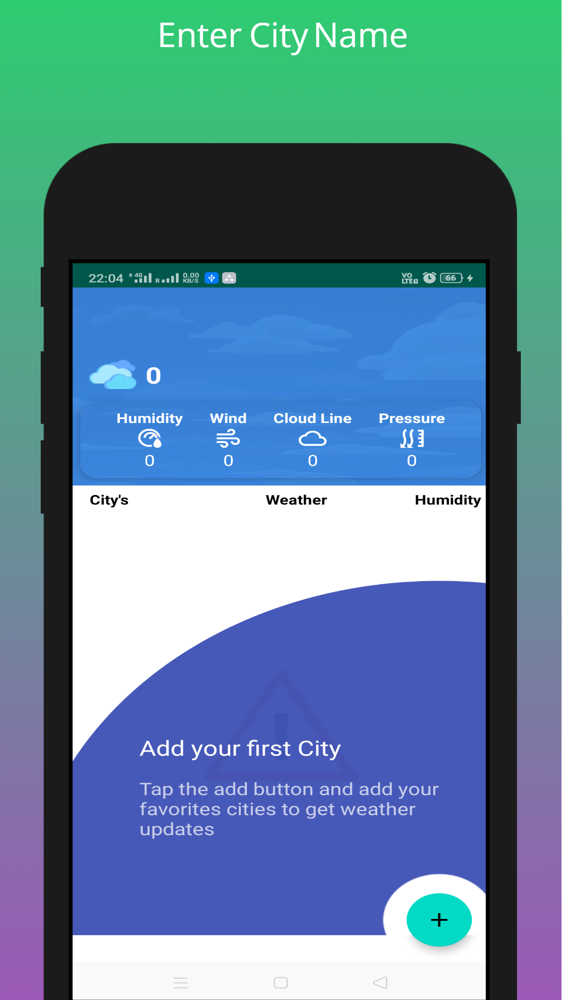
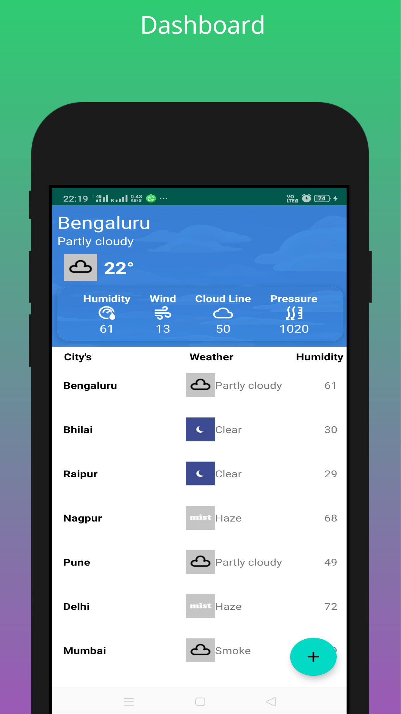

# Weather-App
> A simple weather android app inspired in material design based on City Name

## Enter City Name to get current Weather details

## Dashboard

# Requirements
 - Android 5.0 (API 21) or above 
 - Build with Android Studio 3.5.3 and above

# Features
 - Material Design
 - Add your favorites cities 
 - Android Cards
 - Some meaningful animations
 - Simple and clean 
 
 # Disclaimer 
- No data persistent was implement, still work in progress 
- Cities will be lost when you terminate the app process

# Tested 
- Realme XT (Color-OS 6)

## Built With

* [Retrofit](http://square.github.io/retrofit/) - A type-safe HTTP client for Android and Java
* [Gson](https://github.com/google/gson) - A Java serialization/deserialization library to convert Java Objects into JSON and back
* [Glide](https://github.com/bumptech/glide) - An image loading and caching library for Android focused on smooth scrolling for Android
* [Card View](https://developer.android.com/guide/topics/ui/layout/cardview) - AThe system provides the CardView API as an easy way for you show information inside cards that have a consistent look across the platform.
* [Recycler View](https://developer.android.com/guide/topics/ui/layout/recyclerview) - The RecyclerView widget is a more advanced and flexible version of ListView.
* [Weather Stack](https://weatherstack.com/) - Retrieve instant, accurate weather information forany location in the world in lightweight JSON format

## Acknowledgments
* Inspiration Simple Weather App
* MaterialDesignDemo by Eajy